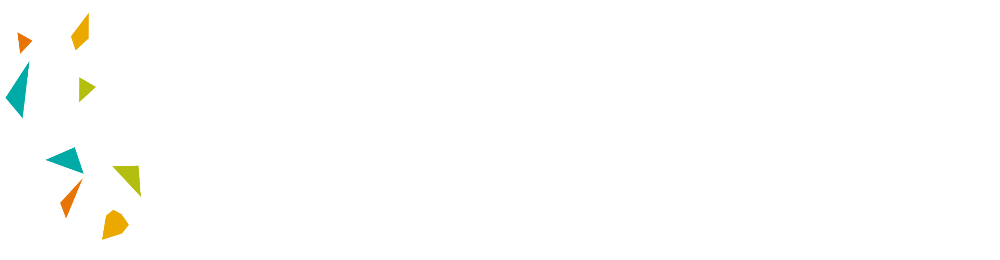

# KAUST Academy Artificial Intelligence Summer 2025

This is the base Repository for the KAUST Academy Summer School that will be held in two locations in the Kingdom of Saudi Arabia.

1. King Abdullah University of Science and Technology (KAUST)
2. King Khalid University (KKU)

## Program Overview

The KAUST Academy Artificial Intelligence Summer School 2025 is designed to provide participants with an in-depth understanding of key AI domains, including Computer Vision, Reinforcement Learning, and Natural Language Processing. The program spans eight weeks, with dedicated modules of three weeks on Computer Vision, two weeks on Reinforcement Learning, and three weeks on Natural Language Processing. Through a blend of theoretical instruction and hands-on projects, students will gain practical skills and insights into emerging challenges across these core areas of AI.

## Content
### Week 1: Computer Vision I
| Topic                                            | Instructor            | Lectures                                    | Labs                                                                                                                                                                                                                                   | Exercises                                                                                                                                                                                                                                                       | Solutions                                                                                                                                                                                                                                                       |
| ------------------------------------------------ | --------------------- | ------------------------------------------- | -------------------------------------------------------------------------------------------------------------------------------------------------------------------------------------------------------------------------------------- | --------------------------------------------------------------------------------------------------------------------------------------------------------------------------------------------------------------------------------------------------------------- | --------------------------------------------------------------------------------------------------------------------------------------------------------------------------------------------------------------------------------------------------------------- |
| **Day 1 (RECAP):** Convolutional Neural Networks | Prof. Naeemullah Khan | [Slides](https://github.com/ALLIA12/KAUST-Academy-Artificial-Intelligence-Summer-2025/blob/main/Lectures/Computer%20Vision/Day%201/Day-1_CNN_Recap.pdf)          | [Lab 1](https://github.com/ALLIA12/KAUST-Academy-Artificial-Intelligence-Summer-2025/blob/main/Labs/Computer%20Vision/Day%201/Day1_1_Pytorch_Basics.ipynb)    [Lab 2](https://github.com/ALLIA12/KAUST-Academy-Artificial-Intelligence-Summer-2025/blob/main/Labs/Computer%20Vision/Day%201/Day1_2_Image_Classification_CNN_CIFAR10.ipynb)  | [Exercise 1](https://github.com/ALLIA12/KAUST-Academy-Artificial-Intelligence-Summer-2025/blob/main/Labs/Computer%20Vision/Day%201/day1_3_EX1_SignLang_CNN.ipynb)  | [Solution 1](https://github.com/ALLIA12/KAUST-Academy-Artificial-Intelligence-Summer-2025/blob/main/Labs/Computer%20Vision/Day%201/day1_3_Sol1_SignLang_CNN.ipynb)  |
| **Day 2:** Unsupervised Learning Overview        | Prof. Naeemullah Khan | [Slides](https://github.com/ALLIA12/KAUST-Academy-Artificial-Intelligence-Summer-2025/blob/main/Lectures/Computer%20Vision/Day%202/Day-2_DUL_Overview.pdf) | [Lab 3](https://github.com/ALLIA12/KAUST-Academy-Artificial-Intelligence-Summer-2025/blob/main/Labs/Computer%20Vision/Day%202/Day2_Food_Image_EDA_DimReduction_Clustering.ipynb)  | [Exercise & Solution Lab 3](https://github.com/ALLIA12/KAUST-Academy-Artificial-Intelligence-Summer-2025/blob/main/Labs/Computer%20Vision/Day%202/Day2_Food_Image_EDA_DimReduction_Clustering_Sol.ipynb)  | [Exercise & Solution Lab 3](https://github.com/ALLIA12/KAUST-Academy-Artificial-Intelligence-Summer-2025/blob/main/Labs/Computer%20Vision/Day%202/Day2_Food_Image_EDA_DimReduction_Clustering_Sol.ipynb)  |
| **Day 3:** Autoencoders (AE)                     | Prof. Naeemullah Khan | [Slides](https://github.com/ALLIA12/KAUST-Academy-Artificial-Intelligence-Summer-2025/blob/main/Lectures/Computer%20Vision/Day%203/Day-3_Autoencoders.pdf)           | [Lab 4](https://github.com/ALLIA12/KAUST-Academy-Artificial-Intelligence-Summer-2025/blob/main/Labs/Computer%20Vision/Day%203/Day3_Image_Generation_AE_MNIST.ipynb)  | [Exercise 4](https://github.com/ALLIA12/KAUST-Academy-Artificial-Intelligence-Summer-2025/blob/main/Labs/Computer%20Vision/Day%203/day3_Image_Generation_EX1_SignLang.ipynb)  | [Solution 4](https://github.com/ALLIA12/KAUST-Academy-Artificial-Intelligence-Summer-2025/blob/main/Labs/Computer%20Vision/Day%203/day3_Image_Generation_SOL_SignLang.ipynb)  |
| **Day 4:** Variational Autoencoders (VAEs)       | Prof. Naeemullah Khan | [Slides](https://github.com/ALLIA12/KAUST-Academy-Artificial-Intelligence-Summer-2025/blob/main/Lectures/Computer%20Vision/Day%204/Day-4_Variational_Autoencoders.pdf)         | [Lab 5](https://github.com/ALLIA12/KAUST-Academy-Artificial-Intelligence-Summer-2025/blob/main/Labs/Computer%20Vision/Day%204/Day4_Image_Generation_VAE_ANIME_update.ipynb)  | [Exercise 5](https://github.com/ALLIA12/KAUST-Academy-Artificial-Intelligence-Summer-2025/blob/main/Labs/Computer%20Vision/Day%204/day4_Image_Generation_EX1_SignLang.ipynb)  | [Solution 5](https://github.com/ALLIA12/KAUST-Academy-Artificial-Intelligence-Summer-2025/blob/main/Labs/Computer%20Vision/Day%204/day4_Image_Generation_EX1_SignLang_solution.ipynb)  |
| **Day 5:** Autoregressive Models                 | Prof. Naeemullah Khan | [Slides](https://github.com/ALLIA12/KAUST-Academy-Artificial-Intelligence-Summer-2025/blob/main/Lectures/Computer%20Vision/Day%205/Day-5_Autoregressive_Models.pdf)           | [Lab 6](https://github.com/ALLIA12/KAUST-Academy-Artificial-Intelligence-Summer-2025/blob/main/Labs/Computer%20Vision/Day%205/Day5_Pytorch_PixelCNN_Logos.ipynb)  | - | - |

### Week 2: Computer Vision II
| Topic                                           | Instructor                                                 | Lectures                                  | Labs                                                                                                                                                                                                                                      | Exercises                                                                                                                                                                                                                                                          | Solutions                                                                                                                                                                                                                                                          |
| ----------------------------------------------- | ---------------------------------------------------------- | ----------------------------------------- | ----------------------------------------------------------------------------------------------------------------------------------------------------------------------------------------------------------------------------------------- | ------------------------------------------------------------------------------------------------------------------------------------------------------------------------------------------------------------------------------------------------------------------ | ------------------------------------------------------------------------------------------------------------------------------------------------------------------------------------------------------------------------------------------------------------------ |
| **Day 6:** Object Detection                     | Dr. Tanveer Hussain (KAUST) Dr. Shaden Alshammari (KKU) | [Slides](https://github.com/ALLIA12/KAUST-Academy-Artificial-Intelligence-Summer-2025/blob/main/Lectures/Computer%20Vision/Day%206/Day-6_Object_Detection_Overview.pdf)     | [Lab 6a](https://github.com/ALLIA12/KAUST-Academy-Artificial-Intelligence-Summer-2025/blob/main/Labs/Computer%20Vision/Day%206/Day6_1_Object_Detection_FasterRCNN.ipynb)    [Lab 6b](https://github.com/ALLIA12/KAUST-Academy-Artificial-Intelligence-Summer-2025/blob/main/Labs/Computer%20Vision/Day%206/Day6_2_Object_Detection_Yolo.ipynb)    | within the lab | will be added after the lab   |
| **Day 7:** Normalizing Flow Models              | Dr. Tanveer Hussain (KAUST) Dr. Shaden Alshammari (KKU) | [Slides](https://github.com/ALLIA12/KAUST-Academy-Artificial-Intelligence-Summer-2025/blob/main/Lectures/Computer%20Vision/Day%207/Day-7_Normalizing_Flow_Models.pdf)         | [Lab 7](labs/week2/lab7.ipynb)     | within the lab | will be added after the lab |    |
| **Day 8:** GANs (image-to-image translation) | Dr. Tanveer Hussain (KAUST) Dr. Shaden Alshammari (KKU) | [Slides](https://github.com/ALLIA12/KAUST-Academy-Artificial-Intelligence-Summer-2025/blob/main/Lectures/Computer%20Vision/Day%208/Day-8-9_Generative_Adversarial_Networks.pdf) | [Lab 8](labs/week2/lab8.ipynb)       | [Exercise 1 - MNIST](https://github.com/ALLIA12/KAUST-Academy-Artificial-Intelligence-Summer-2025/blob/main/Labs/Computer%20Vision/Day%208/day8_Image_Generation_EX1_MNIST.ipynb)    [Exercise 2 - Birds](https://github.com/ALLIA12/KAUST-Academy-Artificial-Intelligence-Summer-2025/blob/main/Labs/Computer%20Vision/Day%208/day8_Image_Generation_EX2_Birds.ipynb)  | will be added after the lab               |
| **Day 9:** Conditional GANs, PixelCNN & WaveGAN | Dr. Tanveer Hussain (KAUST) Dr. Shaden Alshammari (KKU) | [Slides](https://github.com/ALLIA12/KAUST-Academy-Artificial-Intelligence-Summer-2025/blob/main/Lectures/Computer%20Vision/Day%208/Day-8-9_Generative_Adversarial_Networks.pdf)      | [Lab 9](labs/week2/lab9.ipynb)     | within the lab | will be added after the lab |    |
| **Day 10:** Diffusion Models                    | Dr. Tanveer Hussain (KAUST) Dr. Shaden Alshammari (KKU) | [Slides](https://github.com/ALLIA12/KAUST-Academy-Artificial-Intelligence-Summer-2025/blob/main/Lectures/Computer%20Vision/Day%2010/Day-10_Diffusion_Models.pdf) | [Lab 10](labs/week2/lab10.ipynb)  | within the lab | will be added after the lab | |

### Week 3: Computer Vision III
| Topic                                           | Instructor                                                 | Lectures                                  | Labs                                                                                                                                                                                                                                      | Exercises                                                                                                                                                                                                                                                          | Solutions                                                                                                                                                                                                                                                          |
| ----------------------------------------------- | ---------------------------------------------------------- | ----------------------------------------- | ----------------------------------------------------------------------------------------------------------------------------------------------------------------------------------------------------------------------------------------- | ------------------------------------------------------------------------------------------------------------------------------------------------------------------------------------------------------------------------------------------------------------------ | ------------------------------------------------------------------------------------------------------------------------------------------------------------------------------------------------------------------------------------------------------------------ |
| **Day 11:** RNN                     | Dr. Tanveer Hussain (KAUST) Dr. Muhammad Mubashar (KKU) | [Slides](https://github.com/ALLIA12/KAUST-Academy-Artificial-Intelligence-Summer-2025/tree/main/Lectures/Computer%20Vision/Day%2011)     | [Lab_11](https://github.com/ALLIA12/KAUST-Academy-Artificial-Intelligence-Summer-2025/blob/main/Labs/Computer%20Vision/Day%2011/Day11_RNN_Image_Captioning.ipynb)  | within the lab | will be added after the lab   |
| **Day 12:** Transformers              | Dr. Tanveer Hussain (KAUST) Dr. Muhammad Mubashar (KKU) | [Slides](https://github.com/ALLIA12/KAUST-Academy-Artificial-Intelligence-Summer-2025/tree/main/Lectures/Computer%20Vision/Day%2012)         | [Lab_12](https://github.com/ALLIA12/KAUST-Academy-Artificial-Intelligence-Summer-2025/blob/main/Labs/Computer%20Vision/Day%2012/Day12_Transformer_image_captioning.ipynb)    | within the lab | will be added after the lab |    |
| **Day 13:** Vision Transformers | Dr. Tanveer Hussain (KAUST) Dr. Muhammad Mubashar (KKU) | [Slides](https://github.com/ALLIA12/KAUST-Academy-Artificial-Intelligence-Summer-2025/tree/main/Lectures/Computer%20Vision/Day%2013) | [Lab_13a](https://github.com/ALLIA12/KAUST-Academy-Artificial-Intelligence-Summer-2025/blob/main/Labs/Computer%20Vision/Day%2013/Day13_VIT_Fine_Tuning.ipynb)    [Lab_13b](https://github.com/ALLIA12/KAUST-Academy-Artificial-Intelligence-Summer-2025/blob/main/Labs/Computer%20Vision/Day%2013/Day6_2_Object_Detection_rtdetr.ipynb)      | [Exercise 1](https://github.com/ALLIA12/KAUST-Academy-Artificial-Intelligence-Summer-2025/blob/main/Labs/Computer%20Vision/Day%2013/Day13_EX1_VIT_Fine_Tuning.ipynb) | will be added after the lab               |
| **Day 14:** Self-Supervised Learning | Dr. Tanveer Hussain (KAUST) Dr. Muhammad Mubashar (KKU) | [Slides](https://github.com/ALLIA12/KAUST-Academy-Artificial-Intelligence-Summer-2025/tree/main/Lectures/Computer%20Vision/Day%2014)      | [Lab_14](https://github.com/ALLIA12/KAUST-Academy-Artificial-Intelligence-Summer-2025/blob/main/Labs/Computer%20Vision/Day%2014/Day14_and_15_SimCLR.ipynb)     | [Exercise 1](https://github.com/ALLIA12/KAUST-Academy-Artificial-Intelligence-Summer-2025/blob/main/Labs/Computer%20Vision/Day%2014/Self_Supervised_MNIST_EX1.ipynb)  | will be added after the lab |    |
| **Day 15:** Contrastive Learning                    | Dr. Tanveer Hussain (KAUST) Dr. Muhammad Mubashar (KKU) | [Slides](https://github.com/ALLIA12/KAUST-Academy-Artificial-Intelligence-Summer-2025/tree/main/Lectures/Computer%20Vision/Day%2015) | [Lab_15](https://github.com/ALLIA12/KAUST-Academy-Artificial-Intelligence-Summer-2025/blob/main/Labs/Computer%20Vision/Day%2014/Day15_Video_CNN-Optional.ipynb)  | within the lab | will be added after the lab | |

### Week 4: Reinforcement Learning I

| Topic                                          | Instructor                              | Slides | Labs | Exercises | Solutions |
|-----------------------------------------------|-----------------------------------------|--------|------|-----------|-----------|
| **Day 1:** Introduction to Reinforcement Learning | Dr. Prashant Aparajeya (KAUST, KKU) | [Slides](https://github.com/ALLIA12/KAUST-Academy-Artificial-Intelligence-Summer-2025/blob/main/Lectures/Reinforcement%20learning/Lecture-1_Introduction_Reinforcement_Learning.pdf) | [Lab_1a](https://github.com/ALLIA12/KAUST-Academy-Artificial-Intelligence-Summer-2025/blob/main/Labs/Reinforcement%20Learning/Day%201/Day-1_Demo_RL_with_policies.ipynb)  [Lab_1b](https://github.com/ALLIA12/KAUST-Academy-Artificial-Intelligence-Summer-2025/blob/main/Labs/Reinforcement%20Learning/Day%201/Day-1_Q-Learning.ipynb)  | within the lab | will be added after the lab |
| **Day 2:** DQN + SARSA                         | Dr. Prashant Aparajeya (KAUST, KKU) | [Slides](https://github.com/ALLIA12/KAUST-Academy-Artificial-Intelligence-Summer-2025/blob/main/Lectures/Reinforcement%20learning/Lecture-2_DQN%2BSARSA.pdf) | [Lab_2a](https://github.com/ALLIA12/KAUST-Academy-Artificial-Intelligence-Summer-2025/blob/main/Labs/Reinforcement%20Learning/Day%202/Day-2_SARSA.ipynb)  [Lab_2b](https://github.com/ALLIA12/KAUST-Academy-Artificial-Intelligence-Summer-2025/blob/main/Labs/Reinforcement%20Learning/Day%202/Day-2_DQN.ipynb)  | within the lab | will be added after the lab |
| **Day 3:** Policy Gradient (REINFORCE) + Actor–Critic | Dr. Prashant Aparajeya (KAUST, KKU) | [Slides](https://github.com/ALLIA12/KAUST-Academy-Artificial-Intelligence-Summer-2025/blob/main/Lectures/Reinforcement%20learning/Lecture-3_Policy_Grad%2BREINFORCE%2BActor_Critic.pdf) | [Lab_3a](https://github.com/ALLIA12/KAUST-Academy-Artificial-Intelligence-Summer-2025/blob/main/Labs/Reinforcement%20Learning/Day%203/Day-3_Reinforce.ipynb)  [Lab_3b](https://github.com/ALLIA12/KAUST-Academy-Artificial-Intelligence-Summer-2025/blob/main/Labs/Reinforcement%20Learning/Day%203/Day-3_ActorCritic.ipynb)  | [Exercise_1](https://github.com/ALLIA12/KAUST-Academy-Artificial-Intelligence-Summer-2025/blob/main/Labs/Reinforcement%20Learning/Day%203/actor_critic_EX1_car_racing.ipynb)  | will be added after the lab |
| **Day 4:** Proximal Policy Optimization (PPO)  | Dr. Prashant Aparajeya (KAUST, KKU) | [Slides](https://github.com/ALLIA12/KAUST-Academy-Artificial-Intelligence-Summer-2025/blob/main/Lectures/Reinforcement%20learning/Lecture-4_Policy_Search.pdf) | [Lab_4a](https://github.com/ALLIA12/KAUST-Academy-Artificial-Intelligence-Summer-2025/blob/main/Labs/Reinforcement%20Learning/Day%204/Day-4_Pytorch_TRPO_Acrobot.ipynb)  [Lab_4b](https://github.com/ALLIA12/KAUST-Academy-Artificial-Intelligence-Summer-2025/blob/main/Labs/Reinforcement%20Learning/Day%204/Day-4_PPO.ipynb)  [Lab_4c](https://github.com/ALLIA12/KAUST-Academy-Artificial-Intelligence-Summer-2025/blob/main/Labs/Reinforcement%20Learning/Day%204/Day-4_PPO_Custom_Pytorch_Flappy_Bird.ipynb)  | [Exercise_1](https://github.com/ALLIA12/KAUST-Academy-Artificial-Intelligence-Summer-2025/blob/main/Labs/Reinforcement%20Learning/Day%204/TRPO_EX1_car_racing.ipynb)    [Exercise_2](https://github.com/ALLIA12/KAUST-Academy-Artificial-Intelligence-Summer-2025/blob/main/Labs/Reinforcement%20Learning/Day%204/PPO_EX2_car_racing.ipynb) | will be added after the lab |
| **Day 5:** DDPG  | Dr. Prashant Aparajeya (KAUST, KKU) | [Slides](https://github.com/ALLIA12/KAUST-Academy-Artificial-Intelligence-Summer-2025/blob/main/Lectures/Reinforcement%20learning/Lecture-5_DDPG.pdf) | [Lab_5](https://github.com/ALLIA12/KAUST-Academy-Artificial-Intelligence-Summer-2025/blob/main/Labs/Reinforcement%20Learning/Day%205/Day-5_DDPG_Custom_Pytorch_Walker.ipynb)  | within the lab | will be added after the lab |

### Week 5: Reinforcement Learning II

| Topic                                          | Instructor                              | Slides | Labs | Exercises | Solutions |
|-----------------------------------------------|-----------------------------------------|--------|------|-----------|-----------|
| **Day 6:** Soft Actor Critic | Prof. Fabio Cuzzolin (KAUST) Dr. Prashant Aparajeya (KKU) | [Slides](https://github.com/ALLIA12/KAUST-Academy-Artificial-Intelligence-Summer-2025/blob/main/Lectures/Reinforcement%20learning/Lecture-6_Soft_Actor-Critic.pdf) | [Lab_6](https://github.com/ALLIA12/KAUST-Academy-Artificial-Intelligence-Summer-2025/blob/main/Labs/Reinforcement%20Learning/Day%206/Day-6_SAC_SB3_Humanoid_Standup.ipynb) | [Exercise_1](https://github.com/ALLIA12/KAUST-Academy-Artificial-Intelligence-Summer-2025/blob/main/Labs/Reinforcement%20Learning/Day%206/SAC_EX1_car_racing.ipynb)  | will be added after the lab |
| **Day 7:** Model Based RL                         | Prof. Fabio Cuzzolin (KAUST) Dr. Prashant Aparajeya (KKU) | [Slides](https://github.com/ALLIA12/KAUST-Academy-Artificial-Intelligence-Summer-2025/blob/main/Lectures/Reinforcement%20learning/Lecture-7_Model_Based_RL.pdf) | [Lab_7](https://github.com/ALLIA12/KAUST-Academy-Artificial-Intelligence-Summer-2025/blob/main/Labs/Reinforcement%20Learning/Day%207/7_ModelBased.ipynb) | within the lab | will be added after the lab |
| **Day 8:** Exploration vs Exploitation Multiarm Bandits | Prof. Fabio Cuzzolin (KAUST) Dr. Prashant Aparajeya (KKU) | [Slides](https://github.com/ALLIA12/KAUST-Academy-Artificial-Intelligence-Summer-2025/blob/main/Lectures/Reinforcement%20learning/Lecture-8_Exploration_vs_Exploitation_Multiarm_Bandits.pdf) | [Lab_8](https://github.com/ALLIA12/KAUST-Academy-Artificial-Intelligence-Summer-2025/blob/main/Labs/Reinforcement%20Learning/Day%208/Day-8_Multi_arm_bandit_explore_vs_exploit.ipynb)  | within the lab | will be added after the lab |
| **Day 9:** RL in Real World  | Prof. Fabio Cuzzolin (KAUST) Dr. Prashant Aparajeya (KKU) | [Slides](https://github.com/ALLIA12/KAUST-Academy-Artificial-Intelligence-Summer-2025/blob/main/Lectures/Reinforcement%20learning/Lecture-9_RL_in_real_world.pdf) | [Lab_9a](https://github.com/ALLIA12/KAUST-Academy-Artificial-Intelligence-Summer-2025/blob/main/Labs/Reinforcement%20Learning/Day%209/Day-9_SAC_SB3_Pusher.ipynb)  [Lab_9b](https://github.com/ALLIA12/KAUST-Academy-Artificial-Intelligence-Summer-2025/blob/main/Labs/Reinforcement%20Learning/Day%209/Day-9_SAC_SB3_Panda_Pick_And_Place.ipynb)  | within the lab | will be added after the lab |
| **Day 10:** Meta RL Open Problems  | Prof. Fabio Cuzzolin (KAUST) Dr. Prashant Aparajeya (KKU) | [Slides](https://github.com/ALLIA12/KAUST-Academy-Artificial-Intelligence-Summer-2025/blob/main/Lectures/Reinforcement%20learning/Lecture-10_Meta_RL_Open_problems.pdf) |  | within the lab | will be added after the lab |

### Week 6: Natural Language Processing I

| Topic                                          | Instructor                              | Slides | Labs | Exercises | Solutions |
|-----------------------------------------------|-----------------------------------------|--------|------|-----------|-----------|
| **Day 1:** Introduction to NLP | Prof. George Turkiyyah (KAUST) Dr. Muhammad Mubashar (KKU) | [Slides](https://github.com/ALLIA12/KAUST-Academy-Artificial-Intelligence-Summer-2025/blob/main/Lectures/Natural%20Language%20Processing/Lecture-1_Introduction_NLP.pdf) | [Lab_1a](https://github.com/ALLIA12/KAUST-Academy-Artificial-Intelligence-Summer-2025/blob/main/Labs/Natural%20Language%20Processing/Day%201/Text_Pre_Processing.ipynb)  [Lab_1b](https://github.com/ALLIA12/KAUST-Academy-Artificial-Intelligence-Summer-2025/blob/main/Labs/Natural%20Language%20Processing/Day%201/Text_Feature_Engineering_(N_Grams).ipynb)  | within the lab | will be added after the lab |
| **Day 2:** Vector Space + Word Embeddings                         | Prof. George Turkiyyah (KAUST) Dr. Muhammad Mubashar (KKU) | [Slides](https://github.com/ALLIA12/KAUST-Academy-Artificial-Intelligence-Summer-2025/blob/main/Lectures/Natural%20Language%20Processing/Lecture-2_Vector_Space%2BWord_Embeddings.pdf) | [Lab_2](https://github.com/ALLIA12/KAUST-Academy-Artificial-Intelligence-Summer-2025/blob/main/Labs/Natural%20Language%20Processing/Day%202/WordEmbedding(GloVe).ipynb)  | within the lab | will be added after the lab |
| **Day 3:** RNN | Prof. George Turkiyyah (KAUST) Dr. Muhammad Mubashar (KKU) | [Slides](https://github.com/ALLIA12/KAUST-Academy-Artificial-Intelligence-Summer-2025/blob/main/Lectures/Natural%20Language%20Processing/Lecture-3_RNN.pdf) | [Lab_3a](https://github.com/ALLIA12/KAUST-Academy-Artificial-Intelligence-Summer-2025/blob/main/Labs/Natural%20Language%20Processing/Day%203/RNN_Many_to_One.ipynb)  [Lab_3b](https://github.com/ALLIA12/KAUST-Academy-Artificial-Intelligence-Summer-2025/blob/main/Labs/Natural%20Language%20Processing/Day%203/RNN_One_to_Many.ipynb)  | within the lab | will be added after the lab |
| **Day 4:** RNN Improvements  | Prof. George Turkiyyah (KAUST) Dr. Muhammad Mubashar (KKU) | [Slides](https://github.com/ALLIA12/KAUST-Academy-Artificial-Intelligence-Summer-2025/blob/main/Lectures/Natural%20Language%20Processing/Lecture-4_RNN_Improvements.pdf) | [Lab_4](https://github.com/ALLIA12/KAUST-Academy-Artificial-Intelligence-Summer-2025/blob/main/Labs/Natural%20Language%20Processing/Day%204/RNN_LSTM_GRU_lab.ipynb)  | within the lab| will be added after the lab |
| **Day 5:** Seq2Seq Models  | Prof. George Turkiyyah (KAUST) Dr. Muhammad Mubashar (KKU) | [Slides](https://github.com/ALLIA12/KAUST-Academy-Artificial-Intelligence-Summer-2025/blob/main/Lectures/Natural%20Language%20Processing/Lecture-5_Seq2Seq_Models.pdf) | [Lab_5](https://github.com/ALLIA12/KAUST-Academy-Artificial-Intelligence-Summer-2025/blob/main/Labs/Natural%20Language%20Processing/Day%205/Arabic-English_Seq2Seq_Translation.ipynb)  | within the lab | will be added after the lab |

### Week 7: Natural Language Processing II

| Topic                                          | Instructor                              | Slides | Labs | Exercises | Solutions |
|-----------------------------------------------|-----------------------------------------|--------|------|-----------|-----------|
| **Day 6:** Attention Mechanism | Prof. George Turkiyyah (KAUST) Dr. Muhammad Mubashar (KKU) | [Slides](https://github.com/ALLIA12/KAUST-Academy-Artificial-Intelligence-Summer-2025/blob/main/Lectures/Natural%20Language%20Processing/Lecture-6_Attention_Mechanism_Deep_Dive.pdf) | [Lab_6](https://github.com/ALLIA12/KAUST-Academy-Artificial-Intelligence-Summer-2025/blob/main/Labs/Natural%20Language%20Processing/Day%206/Attention_Mechanism.ipynb) | within the lab | will be added after the lab |
| **Day 7:** Transformers                         | Prof. George Turkiyyah (KAUST) Dr. Muhammad Mubashar (KKU) | [Slides](https://github.com/ALLIA12/KAUST-Academy-Artificial-Intelligence-Summer-2025/blob/main/Lectures/Natural%20Language%20Processing/Lecture-7%2B8_Transformers.pdf) | [Lab_7a](https://github.com/KAUST-Academy/KAUST-Academy-Artificial-Intelligence-Summer-2025/blob/main/Labs/Natural%20Language%20Processing/Day%207/Self_Attention_%26_MHA.ipynb)  [Lab_7b](https://github.com/KAUST-Academy/KAUST-Academy-Artificial-Intelligence-Summer-2025/blob/main/Labs/Natural%20Language%20Processing/Day%207/attention-based-classifier.ipynb)| within the lab | will be added after the lab |
| **Day 8:** Transformers | Prof. George Turkiyyah (KAUST) Dr. Muhammad Mubashar (KKU) | [Slides](https://github.com/ALLIA12/KAUST-Academy-Artificial-Intelligence-Summer-2025/blob/main/Lectures/Natural%20Language%20Processing/Lecture-7%2B8_Transformers.pdf) | [Lab_8a](https://github.com/KAUST-Academy/KAUST-Academy-Artificial-Intelligence-Summer-2025/blob/main/Labs/Natural%20Language%20Processing/Day%208/Transformer_finetuning.ipynb)  [Lab_8b](https://github.com/KAUST-Academy/KAUST-Academy-Artificial-Intelligence-Summer-2025/blob/main/Labs/Natural%20Language%20Processing/Day%208/BERT_and_T5_for_Question_Answering_Answer.ipynb)  [Lab8c](https://github.com/KAUST-Academy/KAUST-Academy-Artificial-Intelligence-Summer-2025/blob/main/Labs/Natural%20Language%20Processing/Day%208/Transformers_with_BERT.ipynb) | within the lab | will be added after the lab |
| **Day 9:** Large Language Model  | Prof. George Turkiyyah (KAUST) Dr. Muhammad Mubashar (KKU) | [Slides](https://github.com/ALLIA12/KAUST-Academy-Artificial-Intelligence-Summer-2025/blob/main/Lectures/Natural%20Language%20Processing/Lecture-9_Large_Language_Models.pdf) | [Lab_9](https://github.com/ALLIA12/KAUST-Academy-Artificial-Intelligence-Summer-2025/blob/main/Labs/Natural%20Language%20Processing/Day%209/mBART_Fine-tuning.ipynb)  | within the lab | will be added after the lab |
| **Day 10:** Prompting + RAG | Prof. George Turkiyyah (KAUST) Dr. Muhammad Mubashar (KKU) | [Slides](https://github.com/ALLIA12/KAUST-Academy-Artificial-Intelligence-Summer-2025/blob/main/Lectures/Natural%20Language%20Processing/Lecture-10_Prompting_%26_RAG.pdf) | [Lab_10](https://github.com/ALLIA12/KAUST-Academy-Artificial-Intelligence-Summer-2025/blob/main/Labs/Natural%20Language%20Processing/Day%2010/Prompt_Engineering.ipynb)  | within the lab | will be added after the lab |

### Week 8: Advanced Topics (NLP III)

| Topic                                          | Instructor                              | Slides | Labs | Exercises | Solutions |
|-----------------------------------------------|-----------------------------------------|--------|------|-----------|-----------|
| **Day 11:** NLP Recent Advancements | Dr. Salman Khan (KAUST, KKU) | [Slides](https://github.com/KAUST-Academy/KAUST-Academy-Artificial-Intelligence-Summer-2025/blob/main/Lectures/Natural%20Language%20Processing/Lecture-11-12_NLP_Recent_Advancements.pdf) | [Lab_11a](https://github.com/KAUST-Academy/KAUST-Academy-Artificial-Intelligence-Summer-2025/blob/main/Labs/Natural%20Language%20Processing/Day%2011/QLoRA.ipynb)   [Lab_11b](https://github.com/KAUST-Academy/KAUST-Academy-Artificial-Intelligence-Summer-2025/blob/main/Labs/Natural%20Language%20Processing/Day%2011/Llama3_2_(1B_and_3B)_Conversational_Question%20(1).ipynb)| within the lab | will be added after the lab |
| **Day 12:** NLP Recent Advancements | Dr. Salman Khan (KAUST, KKU) | [Slides](https://github.com/KAUST-Academy/KAUST-Academy-Artificial-Intelligence-Summer-2025/blob/main/Lectures/Natural%20Language%20Processing/Lecture-11-12_NLP_Recent_Advancements.pdf) | [Lab_12](https://github.com/KAUST-Academy/KAUST-Academy-Artificial-Intelligence-Summer-2025/blob/main/Labs/Natural%20Language%20Processing/Day%2012/Qwen3_(4B)_GRPO.ipynb)| within the lab | will be added after the lab |
| **Day 13:** Multimodal & Code Generation | Dr. Salman Khan (KAUST, KKU) | [Slides](https://github.com/KAUST-Academy/KAUST-Academy-Artificial-Intelligence-Summer-2025/blob/main/Lectures/Natural%20Language%20Processing/Lecture-13_Multimodal_%26_Code_Generation.pdf) | [Lab_13](https://github.com/KAUST-Academy/KAUST-Academy-Artificial-Intelligence-Summer-2025/blob/main/Labs/Natural%20Language%20Processing/Day%2013/VLLM.ipynb) | within the lab | will be added after the lab |
| **Day 14:** Audio Processing In NLP  | Dr. Salman Khan (KAUST, KKU) | [Slides](https://github.com/KAUST-Academy/KAUST-Academy-Artificial-Intelligence-Summer-2025/blob/main/Lectures/Natural%20Language%20Processing/Lecture-14-15_Audio_Processing_In_NLP.pdf) | [Lab_14] | within the lab | will be added after the lab |
| **Day 15:** Audio Processing In NLP | Dr. Salman Khan (KAUST, KKU) | [Slides](https://github.com/KAUST-Academy/KAUST-Academy-Artificial-Intelligence-Summer-2025/blob/main/Lectures/Natural%20Language%20Processing/Lecture-14-15_Audio_Processing_In_NLP.pdf) | [Lab_15] | within the lab | will be added after the lab |

## Instructors

- KAUST:
  - [Prof. Naeemullah Khan](https://www.linkedin.com/in/profkhan/?originalSubdomain=sa)
    - Week 1
  - [Dr. Tanveer Hussain](https://www.linkedin.com/in/tinu445/)
    - Week 2
    - Week 3
  - [Dr. Prashant Aparajeya](https://www.linkedin.com/in/prashant-aparajeya/?originalSubdomain=uk)
    - Week 4
  - [Prof. Fabio Cuzzolin](https://www.linkedin.com/in/fabio-cuzzolin/)
    - Week 5
  - [Prof. George Turkiyyah](https://cemse.kaust.edu.sa/profiles/george-turkiyyah)
    - Week 6
    - Week 7
  - [Dr. Salman Khan](https://www.linkedin.com/in/salman-khan-240aab109/?originalSubdomain=uk)
    - Week 8
- KKU:
  - [Prof. Naeemullah Khan](https://www.linkedin.com/in/profkhan/?originalSubdomain=sa)
    - Week 1
  - [Dr. Shaden Alshammari](https://shadealsha.github.io/)
    - Week 2
  - [Dr. Muhammad Mubashar](https://www.linkedin.com/in/muhammad-mubashar-719b05167/)
    - Week 3
    - Week 6
    - Week 7
  - [Dr. Prashant Aparajeya](https://www.linkedin.com/in/prashant-aparajeya/?originalSubdomain=uk)
    - Week 4
    - Week 5
  - [Dr. Salman Khan](https://www.linkedin.com/in/salman-khan-240aab109/?originalSubdomain=uk)
    - Week 8

## Teaching Assistants

- [Ali Habibullah](https://www.linkedin.com/in/ali-habibullah/)
- [Abdallah Hammad](https://www.linkedin.com/in/abdallah-hammad-5059b6298/)
- [Abdulaziz Alomair](https://www.linkedin.com/in/abdulazizom/?originalSubdomain=sa)
- [Abdullah Jan](https://www.linkedin.com/in/abdullah-jan-929694298)
- [Abdulrahman Alfrihidi](https://www.linkedin.com/in/abdulrahman-alfrihidi-0243a528a/)
- [Ali Alqutayfi](https://www.linkedin.com/in/ali-alqutayfi)
- [Dr. Amanat Kafizov](https://www.linkedin.com/in/amanat-kafizov-649b75174/?locale=en_US)
- [Bader Alshamrani](https://www.linkedin.com/in/bader-alshamrani-49a04a245/?originalSubdomain=sa)
- [Daniel Alsadiq](https://www.linkedin.com/in/daniel-alsadiq/?originalSubdomain=sa)
- [Harethah Abu Shairah](https://www.linkedin.com/in/harethahmo/)
- [Hassain alsayhah](https://www.linkedin.com/in/hassain-alsayhah/?originalSubdomain=sa)
- [Hassan Alsayhah](https://www.linkedin.com/in/hassan-alsayhah-28a83a251/?originalSubdomain=sa)
- [Dr. Kerven Durdymyradov](https://www.linkedin.com/in/kerven-durdymyradov/)
- [Lama Ayash](https://www.linkedin.com/in/lama-ayash-9b9383224/?originalSubdomain=sa)
- [Mohamed Eltayeb](https://www.linkedin.com/in/mohammad2012191/?originalSubdomain=sa)
- [Yazan Alshuaibi](https://www.linkedin.com/in/yazenalshaebi/)

## 🏆 Certification

Participants who successfully complete the program, meet the attendance requirements, and submit the final deliverables will receive a Certificate of Completion from KAUST Academy, signed by:

- Prof. Naemmullah Khan, Deputy Director, KAUST Academy | Instructional Assistant Professor, KAUST | Associate Research Fellow, LMH, University of Oxford
- Prof. Sultan Albarakati, Associate Vice President, Saudi Talent Development, KAUST

Final deliverables include:

- A comprehensive project report
- The project source code
- A presentation poster

Maintained by The Teaching Team
